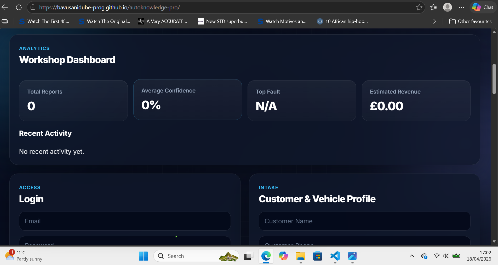
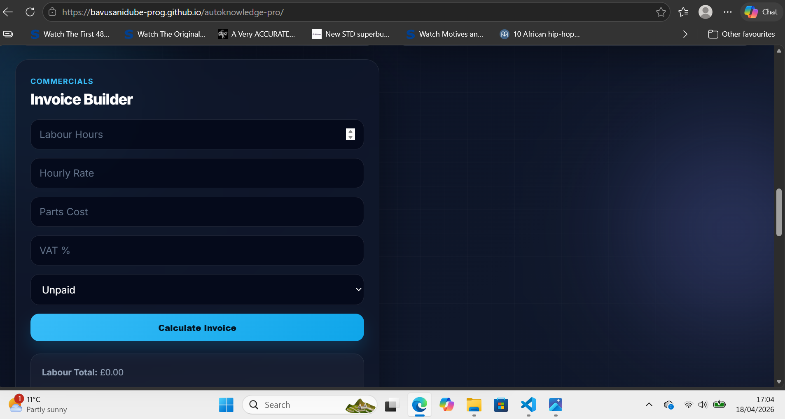
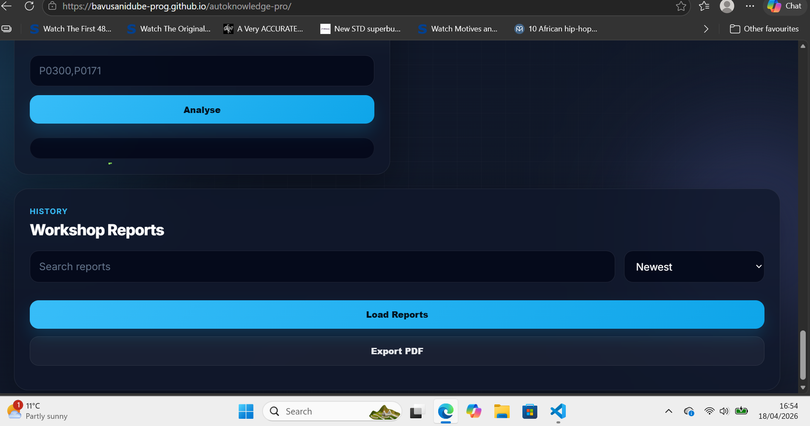

# AutoKnowledge Pro AI

Premium workshop management and vehicle diagnostics web application built for modern garages.

## Live Demo

https://bavusanidube-prog.github.io/autoknowledge-pro/

---

## Screenshots

### Dashboard



### Invoice Builder



### Reports System



---

## Features

- Secure Firebase Authentication
- Customer & Vehicle Profile Intake
- AI Diagnostic Engine
- OBD Fault Code Lookup
- Smart Invoice Builder
- Revenue Dashboard
- Workshop Reports History
- PDF Export
- Responsive Premium UI
- GitHub Pages Deployment

---

## Tech Stack

- HTML5
- CSS3
- JavaScript (Vanilla)
- Firebase Authentication
- Cloud Firestore
- GitHub Pages

---

## Business Use Case

Designed as a lightweight SaaS platform for independent garages and workshop owners who need:

- customer management
- diagnostics workflow
- invoicing
- reporting
- operational analytics

---

## How to Run Locally

```bash
git clone https://github.com/bavusanidube-prog/autoknowledge-pro.git
cd autoknowledge-pro